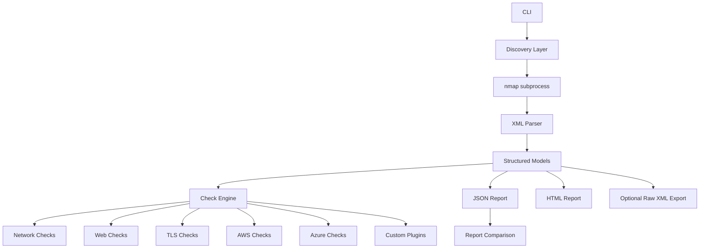

# AccuScanner

AccuScanner is a defensive, Nessus-inspired vulnerability assessment tool built in Python for owned and authorized systems. It orchestrates `nmap`, parses structured results, applies modular checks across network, web, TLS, AWS, and Azure posture, and exports polished JSON and HTML reports.

## Why This Project Is Strong Portfolio Material

- Uses real security tooling instead of reimplementing a port scanner
- Shows clean Python architecture with modular checks, typed models, config profiles, and plugin loading
- Produces recruiter-friendly artifacts: styled reports, examples, CI, tests, Docker support, and cross-platform usage docs
- Covers infrastructure exposure, common web weaknesses, and cloud posture checks in one project

## Core Capabilities

- CLI built with `argparse`
- Scan modes: `quick`, `full`, `web`, `aws`, and `azure`
- Supports IPs, hostnames, CIDR ranges, and URLs
- Uses `nmap` through `subprocess` for host discovery, service detection, and version detection
- Parses `nmap` XML into structured dataclasses
- Plugin-based checks architecture plus external plugin loading
- YAML scan profiles with ignore rules and reusable scan settings
- Authenticated Linux host review over SSH
- Authenticated Windows host review over WinRM
- Local static code scanning for secrets, insecure patterns, and configuration issues
- Read-only PostgreSQL and MySQL posture scanning with user-supplied audit credentials
- Local CVE mapping from detected service/version data
- Aggregate dashboard generation across many reports
- Exports JSON, HTML, and optional raw XML
- Timestamped directories and clean timestamped filenames
- Compares reports to show new and resolved findings
- Cross-platform friendly for Ubuntu and Windows when `nmap` is installed and available in `PATH` or `NMAP_PATH`

## Detection Coverage

### Network and Service Checks

- Risky exposed ports such as `21`, `23`, `3389`, and `5900`
- Internet-facing SMB, Docker, Memcached, MongoDB, Redis, Elasticsearch, SNMP, and SMTP exposure warnings
- Anonymous FTP detection
- Lightweight active verification for Redis, Docker API, Elasticsearch, and MongoDB exposure
- Banner and service metadata exposure warnings

### Web Checks

- Missing `HSTS`
- Missing `CSP`
- Missing `X-Frame-Options`
- Missing `X-Content-Type-Options`
- Missing `Referrer-Policy`
- Missing `Permissions-Policy`
- Missing `COOP`, `CORP`, and `COEP`
- Insecure HTTP without HTTPS redirect
- Weak cookie flags:
  missing `Secure`
  missing `HttpOnly`
  missing `SameSite`
  broad explicit `Domain` scope signal
- Directory listing indicators
- Default page detection
- Risky HTTP methods such as `TRACE`, `PUT`, and `DELETE`
- TRACE method response verification
- `Server` header disclosure
- Sensitive file and path checks such as `.git`, `.env`, `phpinfo`, `server-status`, and backup paths
- Admin and login surface detection
- Passive same-host crawling for discovered pages, form actions, script assets, and script-derived endpoints
- Optional browser-assisted rendered discovery for JS-heavy apps and SPA-style navigation
- Attack-surface inventory for discovered pages, documents, static assets, form actions, query parameters, and form fields
- Passive review for SQL/backend error leakage, suspicious input surfaces, file/upload flows, reset flows, SOAP/WSDL hints, WebDAV, and client-side storage usage
- Lightweight fingerprinting for WordPress, phpMyAdmin, Jenkins, Grafana, Tomcat, Kibana, and Prometheus

### TLS Checks

- Expired certificate
- Certificate expiring soon
- Self-signed certificate indicator
- Hostname mismatch
- Legacy TLS versions
- Weak ciphers
- Trust chain validation errors
- Confidence and tag metadata on findings
- Potential CVE correlation from detected service/product/version matches

### Authenticated Linux Checks

- Passwordless sudo detection
- World-writable privileged path checks
- SSH root login detection
- Host firewall inactivity signal
- Kernel version inventory capture

### Authenticated Windows Checks

- Windows firewall profile disabled detection
- RDP enabled detection
- Guest account enabled detection
- Defender disabled signal
- Windows version inventory capture

### AWS Checks

- Public S3 bucket indicators
- Security groups allowing `0.0.0.0/0` on risky ports
- Public EC2 inventory summary
- Public RDS detection
- Internet-facing load balancer summary
- Weak or missing IAM password policy
- Public EBS snapshot detection
- Public AMI detection

### Azure Checks

- Public IP inventory summary
- NSG rules that allow internet access on risky ports
- Storage accounts with blob public access enabled
- Storage accounts with public network access enabled
- VM inventory summary

## Architecture



## Project Structure

```text
src/mininessus/      # Internal implementation package
src/accuscanner/     # Public package entrypoint
tests/
examples/
.github/workflows/
Dockerfile
```

## Ubuntu Setup

```bash
sudo apt update
sudo apt install -y python3 python3-venv nmap
python3 -m venv .venv
source .venv/bin/activate
pip install --upgrade pip
pip install -e .[dev]
```

If you want AWS and Azure checks:

```bash
aws configure
pip install -e ".[azure]"
az login
```

If you want browser-assisted rendered web discovery:

```bash
pip install -e ".[browser]"
python -m playwright install chromium
```

If you want database posture scanning:

```bash
pip install -e ".[database]"
```

## Windows Setup

1. Install Python 3.11+
2. Install Nmap for Windows and ensure `nmap.exe` is available on `PATH`
3. If Nmap is installed in a custom location, set `NMAP_PATH`

PowerShell example:

```powershell
py -3 -m venv .venv
.venv\Scripts\Activate.ps1
pip install --upgrade pip
pip install -e .[dev]
accuscanner scan 192.168.1.10 --mode quick --timestamped-dir
```

If needed:

```powershell
$env:NMAP_PATH="C:\Program Files (x86)\Nmap\nmap.exe"
```

## CLI Help

Show all commands and options:

```bash
accuscanner --help
accuscanner -h
accuscanner -help
```

Show scan subcommand help:

```bash
accuscanner scan --help
accuscanner scan -h
accuscanner scan -help
```

Show compare subcommand help:

```bash
accuscanner compare --help
```

Show dashboard subcommand help:

```bash
accuscanner dashboard --help
```

## Sample Commands

Quick scan:

```bash
accuscanner scan 192.168.1.10 --mode quick --timestamped-dir
```

Full scan:

```bash
accuscanner scan 10.0.0.0/24 --mode full --timestamped-dir
```

Web scan:

```bash
accuscanner scan https://app.internal.example --mode web --timestamped-dir
```

Browser-assisted web scan:

```bash
accuscanner scan https://app.internal.example --mode web --browser-assisted --browser-max-pages 6 --timestamped-dir
```

Authenticated web session scan:

```bash
accuscanner scan https://app.internal.example --mode web --web-cookie "session=abc123" --web-header "Authorization: Bearer ey..." --browser-assisted --timestamped-dir
```

Code scan:

```bash
accuscanner code-scan /path/to/repo --timestamped-dir
```

Database scan:

```bash
accuscanner db-scan --db-type postgres --host db.internal --port 5432 --database appdb --user audit --password "secret" --timestamped-dir
```

Interactive launcher:

```bash
python -m accuscanner
```

AWS posture scan:

```bash
accuscanner scan 10.0.0.0/24 --mode aws --aws-region eu-west-2 --timestamped-dir
```

Azure posture scan:

```bash
accuscanner scan 10.0.0.0/24 --mode azure --azure-subscription-id <subscription-id> --timestamped-dir
```

Custom ports and raw XML export:

```bash
accuscanner scan 18.175.232.63 --mode quick --ports 22,80,443,6379 --save-raw-xml --timestamped-dir
```

Use a YAML scan profile:

```bash
accuscanner scan 18.175.232.63 --mode full --config examples/scan-profile.yml
```

Enable both cloud providers during the same run:

```bash
accuscanner scan 18.175.232.63 --mode full --enable-aws-checks --enable-azure-checks --timestamped-dir
```

Load custom plugins:

```bash
accuscanner scan 18.175.232.63 --mode full --plugin-dir examples/plugins
```

Run authenticated Linux checks over SSH:

```bash
accuscanner scan 18.175.232.63 --mode full --ssh-user ubuntu --ssh-key-path ~/.ssh/id_rsa --timestamped-dir
```

Run authenticated Windows checks over WinRM:

```bash
accuscanner scan 10.0.0.50 --mode full --winrm-user Administrator --winrm-password "Password123!" --winrm-transport ntlm --timestamped-dir
```

Compare two reports:

```bash
accuscanner compare reports/old.json reports/new.json --output reports/report-diff.json
```

Build an aggregate dashboard from multiple JSON reports:

```bash
accuscanner dashboard reports/*.json --html-output reports/dashboard.html --json-output reports/dashboard.json
```

Run tests:

```bash
pytest
```

## Example Output

Reports are written with clean timestamped filenames:

```text
reports/20260415_120000/
  app.internal.example-web-20260415_120000.json
  app.internal.example-web-20260415_120000.html
  app.internal.example-web-20260415_120000.xml
```

Sample artifacts live in [examples/sample_report.json](examples/sample_report.json), [examples/sample_report.html](examples/sample_report.html), and [examples/sample_cli_output.txt](examples/sample_cli_output.txt).

Example automation assets live in [examples/scan-profile.yml](examples/scan-profile.yml), [examples/plugins/example_custom_check.py](examples/plugins/example_custom_check.py), and [examples/docker-compose.lab.yml](examples/docker-compose.lab.yml).

## HTML Report Highlights

- Severity totals and overall severity score
- Top risks section for fast triage
- Host inventory and open ports
- Asset-grouped remediation recommendations
- Dedicated discovered attack-surface inventory for web scans
- Grouped header findings in HTML so HTTP and HTTPS hardening gaps read more cleanly
- Full finding cards with evidence, confidence, tags, and remediation guidance

## Dashboard Output

The `dashboard` command produces:

- Aggregate severity totals across multiple reports
- Combined severity score
- Top findings across all scans
- Per-report summary for trend and coverage review

## Screenshots

Placeholder paths for future screenshots:

- `docs/screenshots/cli-summary.png`
- `docs/screenshots/html-report-overview.png`
- `docs/screenshots/html-top-risks.png`
- `docs/screenshots/html-findings.png`

## Docker

Build:

```bash
docker build -t accuscanner .
```

Run:

```bash
docker run --rm -it accuscanner scan 192.168.1.10 --mode quick
```

## Custom Plugins

AccuScanner can load simple external check plugins:

```bash
accuscanner scan 192.168.1.10 --plugin-dir examples/plugins
```

Each plugin file can expose either:

- `get_checks()` returning instantiated check objects
- `CHECKS` containing instantiated check objects

## Scan Profiles

AccuScanner supports lightweight YAML profiles for reusable settings:

```bash
accuscanner scan 18.175.232.63 --config examples/scan-profile.yml
```

## CI

GitHub Actions runs the test suite on pushes and pull requests using Ubuntu and installs `nmap` as part of the workflow.

## Limitations

- This is a defensive assessment MVP, not a replacement for a full authenticated enterprise scanner
- Findings are heuristic and exposure-focused
- AWS and Azure checks depend on valid credentials and permissions
- Authenticated Linux checks require valid SSH access and currently target common Linux administrative patterns only
- Authenticated Windows checks require valid WinRM access and currently focus on common host-hardening signals
- Web review is intentionally passive and unauthenticated: it inventories and flags exposed attack surface, but it does not perform active exploitation or destructive testing
- Default JavaScript-aware discovery is lightweight and best-effort rather than full browser-driven crawling
- Browser-assisted mode adds rendered route, form, and client-request discovery, but it still avoids active exploitation and does not submit arbitrary POST workflows by default
- Code scanning is local-path based in v1 and does not clone repositories automatically
- Database scanning is read-only in v1 and expects explicit PostgreSQL or MySQL credentials supplied by the user
- Scan results still depend on network reachability and the target's filtering behavior

## Ethical Use

Use AccuScanner only on systems and cloud accounts you own or are explicitly authorized to assess. Do not scan third-party infrastructure without written permission.
